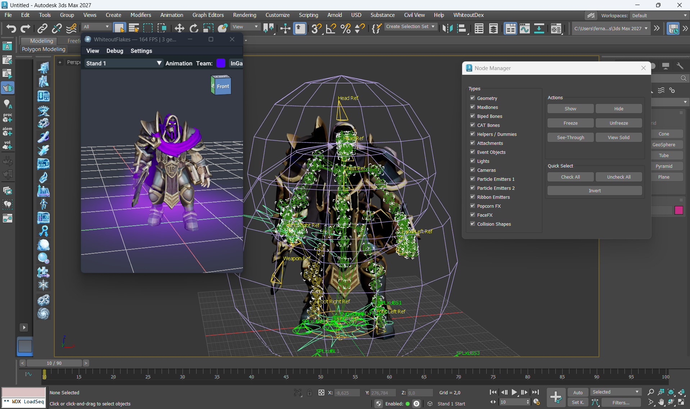
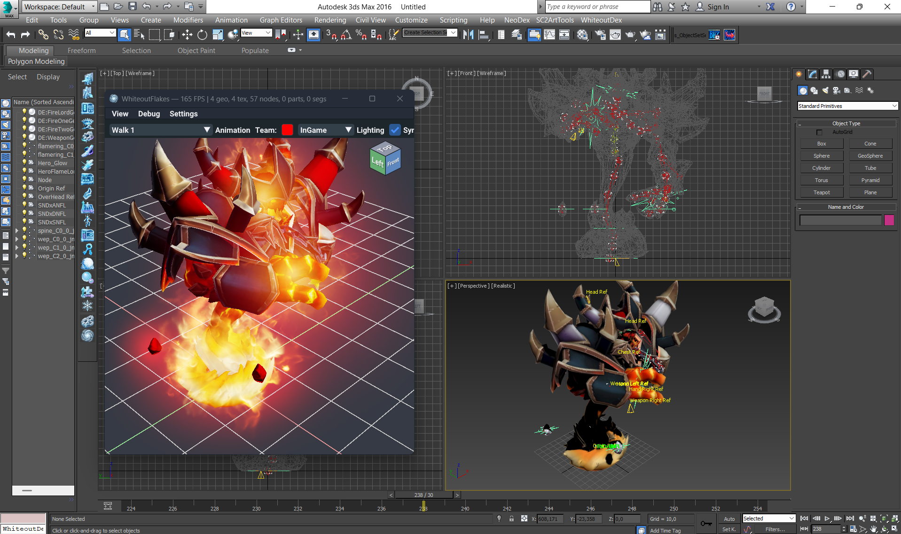

<p align="center">
  
</p>

# WhiteoutDex

**WhiteoutDex** is the next evolution of the [NeoDex](https://github.com/FernandoS27/NeoDex) set of tools, developed by me in collaboration with **DennisH**. It is a powerful set of tools that extends Autodesk's 3ds Max with support for **Warcraft III Classic** and **Warcraft III: Reforged**. You can use it to create, edit, preview and export Warcraft III models (`.mdx` / `.mdl`).

NeoDex was written entirely in MAXScript. WhiteoutDex is its successor, rewritten from the ground up in C++. It runs on every 3ds Max version from **2016** through **2027**, and one installer covers all of them.

## Showcase

WhiteoutDex in 3ds Max 2027: the WhiteoutFlakes previewer plays an imported Reforged model with team color. Next to it are the Node Manager and the model's attach points and collision shape in the viewport.



WhiteoutDex in 3ds Max 2016: the same toolset on a Max release from a decade earlier. WhiteoutFlakes plays the model's walk animation with in-game lighting beside the regular Max viewports.



## Key new features compared to NeoDex

- **Importer and Exporter rewritten in C++**, powered by [WhiteoutLib](https://github.com/FernandoS27/WhiteoutLib).
- **Automatic extraction and conversion of textures.** On import, textures are extracted straight from the game's MPQ (Classic) and CASC (Reforged) archives. On export, they are converted to BLP for Classic or DDS for Reforged.
- **Native Particle Emitter 1, Particle Emitter 2 and Ribbon Emitter plugins**, fully simulated inside 3ds Max right in the viewport.
- **WhiteoutFlakes integration.** [WhiteoutFlakes](https://github.com/FernandoS27/WhiteoutFlakes) is a previewer whose rendering is kept in sync with the game's own renderer, for both Classic and Reforged.
- **CAT support** for animation.
- **Skin quantization for MDX v800.** The exporter fits your skin weights to the Classic format by itself, so you no longer have to balance skin weights by hand.
- **Support for more than a decade of 3ds Max versions:** 2016 through 2027, with newer versions to follow.
- More cool features are planned.

## What it does

As in NeoDex, WhiteoutDex is composed of two main sets:

- **Plugins**: Warcraft III scene objects that work directly inside Max. These include Particle Emitters 1 and 2, Ribbon Emitters, PopcornFX emitters, materials and bitmaps, vertex colors, lights, attach points, event objects, collision shapes and FaceFX.
- **Tools**: utilities that make modeling, rigging, animating and exporting easier. They include the importer, the exporter, the WhiteoutFlakes previewer, the Sequence Manager, the Global Sequence Manager, the Node Manager, animation tools, a keyframe optimizer, skin tools, a visibility keyer, and texture and model browsers.

The interface is available in English, German, Spanish, French, Italian, Japanese, Korean, Brazilian Portuguese, Russian and Simplified Chinese.

## Installation

1. Close 3ds Max if it is already running.
2. Download the latest `WhiteoutDex_Setup_v<version>.exe` from the [Releases](https://github.com/FernandoS27/WhiteoutDex/releases) page.
3. Run the installer. It detects every installed 3ds Max version (2016 and up) and installs WhiteoutDex into `%ProgramData%\Autodesk\ApplicationPlugins\WhiteoutDex`.
4. Start 3ds Max. A new **WhiteoutDex** menu should appear.

Requirements: Windows 10 or newer and 3ds Max 2016 or newer. A local Warcraft III installation (Classic or Reforged) lets the importer pull textures from the game archives.

## Building from source

WhiteoutDex builds with CMake and Visual Studio 2022. Every 3ds Max version you want to target needs its matching 3ds Max SDK installed.

```sh
git clone --recursive https://github.com/FernandoS27/WhiteoutDex.git
cd WhiteoutDex

# Build for every installed Max SDK and produce the installer
cmake -S . -B build -G "Visual Studio 17 2022" -A x64
cmake --build build --config Release --parallel
cmake --build build --config Release --target installer

# Or build for a single Max version
cmake -S . -B build-2026 -DMAX_VERSION=2026
cmake --build build-2026 --config Release --parallel
```

The installer is written to `build/installer/`.

## Credits

- **Authors:** Fernando A. Sahmkow (BlinkBoy / FernandoS27) and DennisH (DennisHerrm)
- Built on the foundation of [NeoDex](https://github.com/FernandoS27/NeoDex) and everyone who contributed to it.

## License

WhiteoutDex is released under the [BSD 3-Clause License](LICENSE.md). Third-party components and their licenses are listed in [THIRD_PARTY.md](THIRD_PARTY.md).
